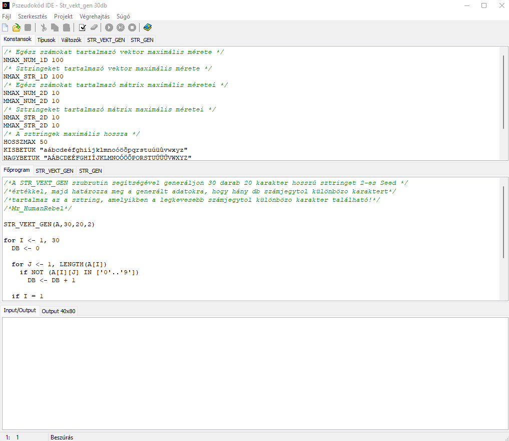
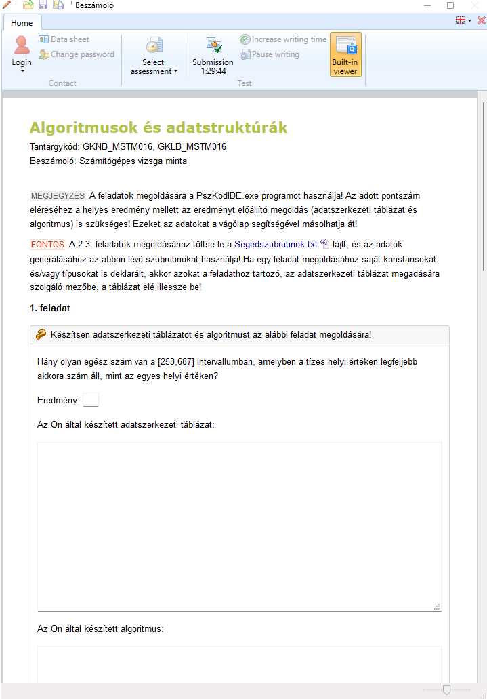

# Pszeudokod
**Széchenyi István Egyetem // Győr // Algoritmusok és adatstruktúrák**

## Információk
**Csak oktatási célokra használd, saját felelősségre!**

*A megoldások nem feltétlenül helyesek, ha igen akkor is lehet, hogy nem a legoptimálisabbak!*

Amennyiben a megoldás használ szöveges/típusos fájlt, az elérési útját módosítani kell a kód működéséhez! A feladatok **jelentős** részénél egy konstans (`FAJLNEV`) értékét kell kicserélni csak! 
*A formátum .txt vagy .dat lehet csak!*

#algovizsganebukjmeg

## Tananyag

Extra .pdf/.png anyagokért ZH-ra és vizsgára bármilyen "alkoholtartalmú üdítőért" vagy "fagyipénzért" cserébe keresd MrHumanRebel-t.

Discord: [Mr_HumanRebel#0023](https://discord.com/users/283988657851990017)

## PszKodIDE

Pszeudokód fejlesztői környezet.

## Impera

Feladatlap-kitöltő program, amivel bejelentkezés után feladatlapokat kérhet le a szerverről, vagy kapcsolat nélküli módban gyakorló feladatokat oldhat meg (`.impera`) kiterjesztésű fájlok megnyitásával.

## Hasznos linkek

[Egyetem](https://www.uni.sze.hu/)

[Pusztai Pál (RS1)](http://rs1.sze.hu/~pusztai/)

[PszKodIDE](http://www.sze.hu/~pusztai/PszKodIDE.zip)

[Impera](https://impera.sze.hu/letoltes/impera_beszamolo_x64.zip)
